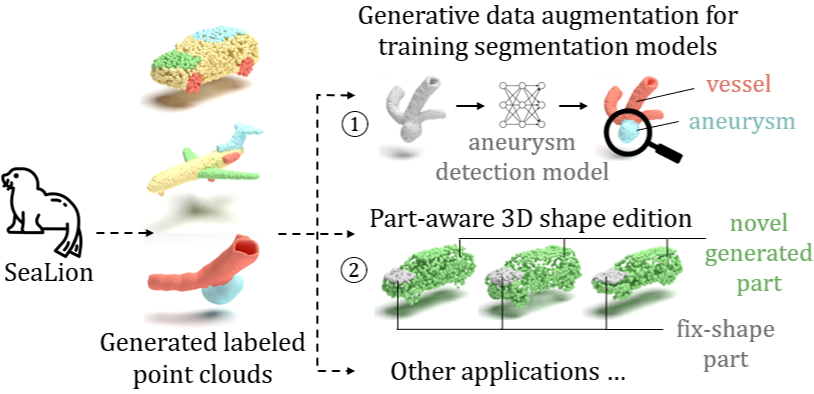

<!-- ## <p align="center">SeaLion: Semantic Part-Aware Latent Point Diffusion Models for 3D Generation<br><br> CVPR 2025 </p> -->

<div align="center">

## SeaLion: Semantic Part-Aware Latent Point Diffusion Models for 3D Generation <br><br> CVPR 2025
</div>

<div align="center">
  <a href="https://dekai21.github.io/" target="_blank">Dekai&nbsp;Zhu</a> &emsp; 
  <a href="https://scholar.google.com/citations?user=HSlGGvwAAAAJ&hl=en" target="_blank">Yan&nbsp;Di</a> &emsp; 
  <a href="https://de.linkedin.com/in/stefangavranovic" target="_blank">Stefan&nbsp;Gavranovic</a> &emsp; 
  <a href="https://scholar.google.de/citations?hl=en&user=ELOVd8sAAAAJ&view_op=list_works" target="_blank">Slobodan&nbsp;Ilic</a>
  <br> <br>
  <a href="https://arxiv.org/abs/2505.17721" target="_blank">Paper</a> &emsp;
  <a href="https://dekai21.github.io/SeaLion/" target="_blank">Project&nbsp;Page</a> 
</div>

<br>
<p align="center">
    
</p>

## Abstract
Denoising diffusion probabilistic models have achieved significant success in point cloud generation, 
enabling numerous downstream applications, such as generative data augmentation and 3D model editing. 
However, little attention has been given to generating point clouds with point-wise segmentation labels, 
as well as to developing evaluation metrics for this task. Therefore, in this paper, we present <strong>SeaLion</strong>, 
a novel diffusion model designed to generate high-quality and diverse point cloud with fine-grained segmentation labels. 
Specifically, we introduce the <strong>semantic part-aware latent point diffusion</strong> technique, 
which leverages the intermediate features of the generative models to jointly predict the noise for perturbed latent points and associated part segmentation labels during the denoising process, 
and subsequently decodes the latent points to point clouds conditioned on part segmentation labels. 
To effectively evaluate the quality of generated point clouds, 
we introduce a novel point cloud pairwise distance calculation method named <strong>part-aware Chamfer distance (p-CD)</strong>. 
This method enables existing metrics, such as 1-NNA, to measure both the local structural quality and inter-part coherence of generated point clouds. 
Experiments on the large-scale synthetic dataset ShapeNet and real-world medical dataset IntrA, 
demonstrate that SeaLion achieves remarkable performance in generation quality and diversity, 
outperforming the existing state-of-the-art model, DiffFacto, by <strong>13.33%</strong> and <strong>6.52%</strong> on 1-NNA (p-CD) across the two datasets. 
Experimental analysis shows that SeaLion can be trained semi-supervised, thereby reducing the demand for labeling efforts. 
Lastly, we validate the applicability of SeaLion in generative data augmentation for training segmentation models and the capability of SeaLion to serve as a tool for part-aware 3D shape editing.

<!-- ## Update
* add pointclouds rendering code used for paper figure, see `utils/render_mitsuba_pc.py`
* When opening an issue, please add @ZENGXH so that I can reponse faster!  -->

## Install 
* Dependencies: 
    * CUDA 11.6 
    
* Setup the environment 
    Install from conda file  
    ``` 
        conda env create --name lion_env --file=env.yaml 
        conda activate lion_env
    ```
    Tested with conda version 22.9.0


<!-- ## Demo
run `python demo.py`, will load the released text2shape model on hugging face and generate a chair point cloud. (Note: the checkpoint is not released yet, the files loaded in the `demo.py` file is not available at this point)

## Released checkpoint and samples 
* checkpoint can be downloaded from [here](https://huggingface.co/xiaohui2022/lion_ckpt)
* after download, run the checksum with `python ./script/check_sum.py ./lion_ckpt.zip`
* put the downloaded file under `./lion_ckpt/` -->

## Training 

### data 
* You can download the full ShapeNetPart dataset from [this link](https://cs.stanford.edu/~ericyi/project_page/part_annotation/) and manually split it following the official train/val/test split. Alternatively, you can download an example of the car category [here](https://huggingface.co/datasets/zdkz/shapenetpart/blob/main/02958343.zip).
* Place the downloaded data into `${ShapeNetPart_dir}` following the structure below: 
```
    ${ShapeNetPart_dir}/
    ├── 02958343/
    │   ├── train/
    │   ├── val/
    │   └── test/
    ├── 02691156/
    │   ├── train/
    │   ├── val/
    │   └── test/
    └── other categories.../
        ├── train/
        ├── val/
        └── test/
```

### train VAE 
* Set the data path `"data.data_dir"` in the config file for VAE training, e.g. `config/sealion_shapenet/cfg_vae_car.yml`.
* Run the following command to start training:
```bash
python train_dist.py  --num_process_per_node ${NUM_GPU}  --config ${VAE_CONFIG_FILE}  --exp_root ${EXP_ROOT}  --exp_name ${EXP_NAME}

e.g. python train_dist.py  --num_process_per_node 1  --config config/sealion_shapenet/cfg_vae_car.yml  --exp_root /data/dekai/sealion/ShapeNetPart/  --exp_name car_vae
```
* If you want to inspect the training progress, the logging folder is located at `${EXP_ROOT}/${category}/`. SeaLion follows the latent diffusion framework introduced in Lion. According to the [suggestions](https://github.com/nv-tlabs/LION/issues/43#issuecomment-1520377502) from the Lion authors, the VAE training time depends on the trade-off between reconstruction accuracy and the smoothness of the latent feature distribution.


### train diffusion prior 
* Set the data path `"data.data_dir"` in the config file for DDPM training, e.g. `config/sealion_shapenet/cfg_ddpm_car.yml`.
* A trained VAE checkpoint is required. Please set the `"sde.vae_checkpoint"` field in the DDPM config file accordingly. You can download a pretrained VAE model for the car category [here](https://huggingface.co/datasets/zdkz/shapenetpart/blob/main/sealion_vae_car_epoch_4499_iters_161999.pt).
* Run the following command to start training:
```bash
python train_dist.py  --num_process_per_node ${NUM_GPU}  --config ${DDPM_CONFIG_FILE}  --exp_root ${EXP_ROOT}  --exp_name ${EXP_NAME}

e.g. python train_dist.py  --num_process_per_node 1  --config config/sealion_shapenet/cfg_ddpm_car.yml  --exp_root /data/dekai/sealion/ShapeNetPart/  --exp_name car_ddpm
```

### evaluate a trained prior 
* Set `DDPM_PRETRAINED_WEIGHT` to the path of the trained DDPM weights. Alternatively, you can download the pretrained weights from [here](https://huggingface.co/datasets/zdkz/shapenetpart/blob/main/sealion_car_trained_weights.zip) and unzip them in the current directory.
* Run the following command to start sampling and evaluation:
```bash
python train_dist.py  --skip_nll 1  --eval_generation  --pretrained $DDPM_PRETRAINED_WEIGHT

e.g. python train_dist.py  --skip_nll 1  --eval_generation  --pretrained sealion_car_trained_weights/ddpm/checkpoints/snapshot
```

<!-- #### other test data
* ShapeNet-Vol test data:
  * please check [here](https://github.com/nv-tlabs/LION/issues/20#issuecomment-1436315100) before using this data
  * [all category](https://drive.google.com/file/d/1QXrCbYKjTIAnH1OhZMathwdtQEXG5TjO/view?usp=sharing): 1000 shapes are sampled from the full validation set 
  * [chair, airplane, car](https://drive.google.com/file/d/11ZU_Bq5JwN3ggI7Ffj4NAjIxxhc2pNZ8/view?usp=share_link)
* table 21 and table 20, point-flow test data 
  * check [here](https://github.com/nv-tlabs/LION/issues/26#issuecomment-1466915318) before using this data
  * [mug](https://drive.google.com/file/d/1lvJh2V94Nd7nZPcRqsCwW5oygsHOD3EE/view?usp=share_link) and [bottle](https://drive.google.com/file/d/1MRl4EgW6-4hOrdRq_e2iGh348a0aCH5f/view?usp=share_link) 
  * 55 catergory [data](https://drive.google.com/file/d/1Rbj1_33sN_S2YUbcJu6h922tKuJyQ2Dm/view?usp=share_link) -->

<!-- ## Evaluate the samples with the 1-NNA metrics 
* download the test data from [here](https://drive.google.com/file/d/1uEp0o6UpRqfYwvRXQGZ5ZgT1IYBQvUSV/view?usp=share_link), unzip and put it as `./datasets/test_data/`
* run `python ./script/compute_score.py` (Note: for ShapeNet-Vol data and table 21, 20, need to set `norm_box=True`) -->

## Acknowledgment
Our implementation builds upon the codebase of [Lion](https://github.com/nv-tlabs/LION), and is released as a forked branch of it.


## Citation
```
@inproceedings{zhu2025sealion,
    title={SeaLion: Semantic Part-Aware Latent Point Diffusion Models for 3D Generation},
    author={Zhu, Dekai and Di, Yan and Gavranovic, Stefan and Ilic, Slobodan},
    booktitle={Proceedings of the Computer Vision and Pattern Recognition Conference},
    pages={11789--11798},
    year={2025}
}
```
